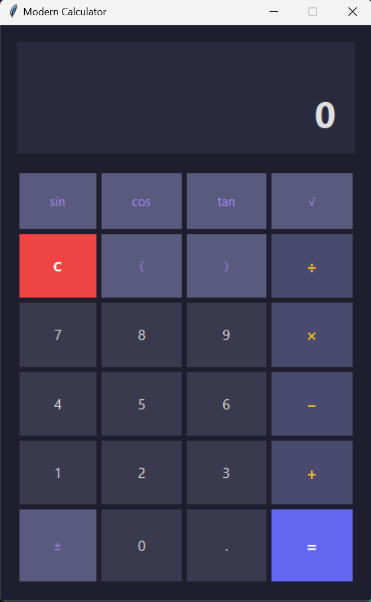

# 🧮 Modern Calculator

A sleek, powerful calculator app with a beautiful dark interface. Works as a GUI app, command-line tool, or Python library—whatever fits your workflow!




## ✨ What Makes It Special

**Beautiful Modern UI** — Clean dark theme with smooth colors and an intuitive layout that feels professional and easy on the eyes.

**Scientific Functions Built-In** — Not just basic math! Get trigonometry, square roots, logarithms, and more without reaching for another tool.

**Multiple Ways to Use It** — Launch the gorgeous GUI, work in your terminal, pipe expressions through it, or import it into your Python projects.

**Keyboard Shortcuts** — Type naturally with full keyboard support. No need to click buttons if you prefer typing.

**Safe & Secure** — Built with security in mind. It won't let you run dangerous code, just pure mathematical expressions.

## 🚀 Getting Started

### Installation

This calculator runs on pure Python with no external dependencies (besides `tkinter` for the GUI, which comes with Python).

1. **Download the script:**
   ```bash
   wget https://github.com/vijayrajeshr/open-source-for-everyone/blob/main/Projects/python%20projects/calculator.py
   # or just save the file from your browser
   ```

2. **Make sure you have Python 3.7 or newer:**
   ```bash
   python --version
   ```

3. **Run it!**
   ```bash
   python calculator.py
   ```

That's it! The beautiful GUI will pop up and you're ready to calculate.

## 🎯 How to Use It

### GUI Mode (The Pretty One!)

Just run the script without any arguments:

```bash
python calculator.py
```

You'll see a modern calculator with:
- **Scientific functions** at the top (sin, cos, tan, √)
- **Number pad** in the middle
- **Operators** on the right side (+, −, ×, ÷)
- **Live expression display** showing what you're typing

**Keyboard shortcuts you'll love:**
- `Enter` or `Return` — Calculate the result
- `Escape` — Clear everything
- `Backspace` — Delete last character
- Type numbers and operators directly!

### Command Line Mode

Perfect for quick calculations in your terminal:

```bash
# Interactive mode
python calculator.py --cli

# Single calculation
python calculator.py --eval "2 + 2"

# Process multiple expressions
echo -e "10 * 5\nsqrt(144)" | python calculator.py --cli
```

### As a Python Library

Import it into your own projects:

```python
from calculator import evaluate_expression

result = evaluate_expression("sin(pi/2) + cos(0)")
print(result)  # Output: 2.0

# Handle errors gracefully
try:
    result = evaluate_expression("2 / 0")
except CalcError as e:
    print(f"Oops! {e}")
```

## 🔢 What Can It Calculate?

### Basic Operations
```
2 + 3          → 5
10 - 4         → 6
5 * 8          → 40
15 / 3         → 5
10 % 3         → 1
2 ** 8         → 256
```

### Parentheses & Order of Operations
```
(2 + 3) * 4    → 20
2 + 3 * 4      → 14
```

### Scientific Functions
```
sqrt(25)       → 5
sin(0)         → 0
cos(pi)        → -1
tan(pi/4)      → 1
log(2.71828)   → 1
log10(100)     → 2
abs(-42)       → 42
pow(2, 10)     → 1024
```

### Mathematical Constants
```
pi             → 3.14159...
e              → 2.71828...
2 * pi         → 6.28318...
```

## 🎨 Interface Features

The modern UI includes:

- **Dark Theme** — Easy on your eyes during long calculation sessions
- **Two-Line Display** — See your expression while typing and the result when you calculate
- **Color-Coded Buttons** — Numbers, operators, and functions are visually distinct
- **Smooth Interactions** — Buttons respond to hover and clicks beautifully
- **Responsive Layout** — Everything scales nicely together

## 🧪 Running Tests

Want to make sure everything works perfectly?

```bash
python calculator.py --run-tests
```

This runs a comprehensive test suite that checks all the mathematical operations, edge cases, and error handling.

## ⌨️ Command Line Options

```bash
python calculator.py              # Launch GUI (default)
python calculator.py --cli        # Interactive terminal mode
python calculator.py --eval "exp" # Evaluate single expression
python calculator.py --run-tests  # Run test suite
python calculator.py --no-gui     # Force CLI even if GUI available
```

## 🛡️ Security Features

This calculator is designed to be safe:

- ✅ Only allows mathematical expressions
- ✅ Blocks imports and dangerous code
- ✅ No file system access
- ✅ No network operations
- ✅ Pure calculation, nothing else

It uses Python's AST (Abstract Syntax Tree) parser to safely evaluate expressions without the risks of `eval()`.

## 🐛 Troubleshooting

**GUI won't launch?**
- Make sure `tkinter` is installed (comes with most Python installations)
- Try: `python -m tkinter` to check if tkinter works
- Use `--cli` flag as a fallback

**Getting "Syntax error"?**
- Check that your expression uses valid math notation
- Remember to close all parentheses
- Functions need parentheses: `sqrt(9)` not `sqrt 9`

**Math domain errors?**
- Can't take square root of negative numbers
- Can't divide by zero
- Check your function arguments are valid

## 📝 License

This project is open source and available under the MIT License. Feel free to use it, modify it, and share it!

## 🤝 Contributing

Found a bug? Have an idea for improvement? Contributions are welcome! 

- Report issues
- Suggest features
- Submit pull requests

## 💡 Tips & Tricks

1. **Chain calculations** — Use the result as the start of your next calculation
2. **Copy expressions** — Highlight and copy from the expression display
3. **Keyboard is faster** — Once you learn the shortcuts, typing is quicker than clicking
4. **Scientific mode** — Click the function buttons or type them: `sin(`, `sqrt(`, etc.
5. **Constants** — Type `pi` or `e` directly in expressions

## 🌟 Why This Calculator?

There are plenty of calculator apps out there. This one is different because:

- **It's beautiful** — Modern design that doesn't look like it's from 2005
- **It's versatile** — GUI, CLI, or library—use it however you want
- **It's powerful** — Scientific functions without the complexity
- **It's safe** — Built with security as a priority
- **It's yours** — Open source and customizable

Enjoy calculating! ✨

---

Made with ❤️ and Python